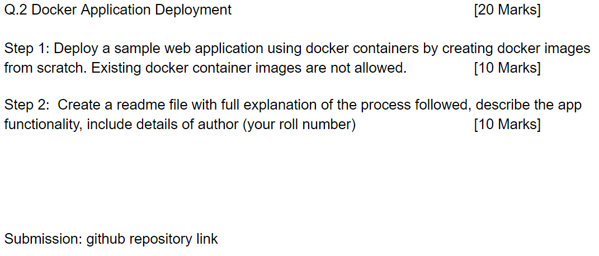

# Docker_assingment_1

This is assignment 1 for Virtualization and Cloud Computing by Roll no - G23AI2039

Here I have made the docker file and ran it (Screenshot attached below)

After running the docker file, my web application is successfully running. 

Thank You

